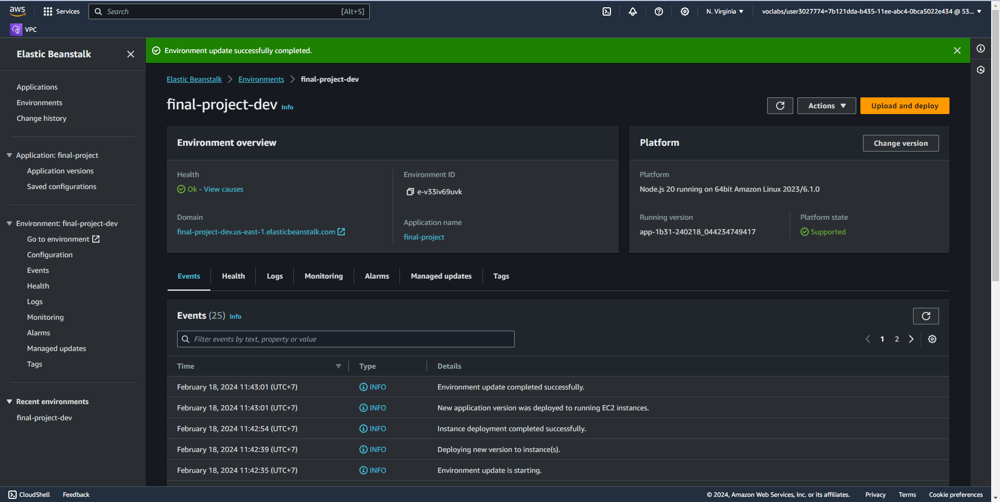

# Image Processing Microservice on AWS
> Project 2 in Cloud Developer Udacity

## Services
- Elastic Beanstalk.

## Project Instructions
To run this project, you will need to perform these steps:
- Setup node environment
```
npm i 
```
- Run application locally
```
npm run dev
```
- Deploy the system
```
eb init
eb create
eb deploy
```

## Testing
You can access the website via this url:
- http://final-project-dev.us-east-1.elasticbeanstalk.com/

Also, you can try this link to see the filtered image:
- http://final-project-dev.us-east-1.elasticbeanstalk.com/filteredimage?image_url=https://upload.wikimedia.org/wikipedia/commons/b/bd/Golden_tabby_and_white_kitten_n01.jpg

Or locally:
- http://localhost:8082/filteredimage?image_url=https://upload.wikimedia.org/wikipedia/commons/b/bd/Golden_tabby_and_white_kitten_n01.jpg

## Expected responses:
- Successful responses should have a 200 code.
- Failed responses should have a 422 code.

## Screenshot
- A screenshot of the elastic beanstalk application dashboard is included in a deployment_screenshot directory.

